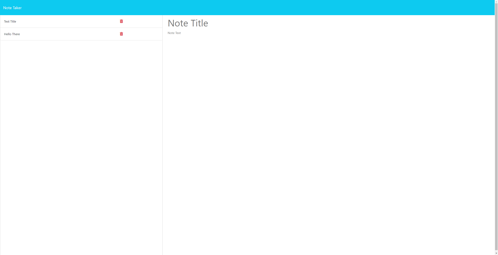
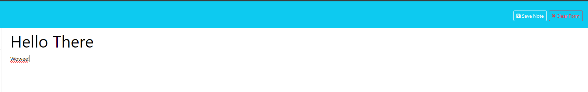

# Note Taker

## Description

I decided to create this project to further my understanding of express routers and routing in general. This site was designed to help others take notes, it has a title and text field for individual notes. Working on this webpage i learned a good bit about the intricacies of using express router and became one step further towards becoming more confident with my routing.

## Installation

To get this aplication to run, all you will need to do is:

1: download this repo to your computer
2: npm install
3: npm start

And voila you have a running note taker

## Usage

All that you'll need to do is type within the 'Note Title' and 'Note Text' fields then click save note and it'll be added to your note list!

## Credits

William Dando: https://github.com/BrdwrdI

## License

MIT License

Copyright (c) 2024 William Dando

Permission is hereby granted, free of charge, to any person obtaining a copy
of this software and associated documentation files (the "Software"), to deal
in the Software without restriction, including without limitation the rights
to use, copy, modify, merge, publish, distribute, sublicense, and/or sell
copies of the Software, and to permit persons to whom the Software is
furnished to do so, subject to the following conditions:

The above copyright notice and this permission notice shall be included in all
copies or substantial portions of the Software.

THE SOFTWARE IS PROVIDED "AS IS", WITHOUT WARRANTY OF ANY KIND, EXPRESS OR
IMPLIED, INCLUDING BUT NOT LIMITED TO THE WARRANTIES OF MERCHANTABILITY,
FITNESS FOR A PARTICULAR PURPOSE AND NONINFRINGEMENT. IN NO EVENT SHALL THE
AUTHORS OR COPYRIGHT HOLDERS BE LIABLE FOR ANY CLAIM, DAMAGES OR OTHER
LIABILITY, WHETHER IN AN ACTION OF CONTRACT, TORT OR OTHERWISE, ARISING FROM,
OUT OF OR IN CONNECTION WITH THE SOFTWARE OR THE USE OR OTHER DEALINGS IN THE
SOFTWARE.